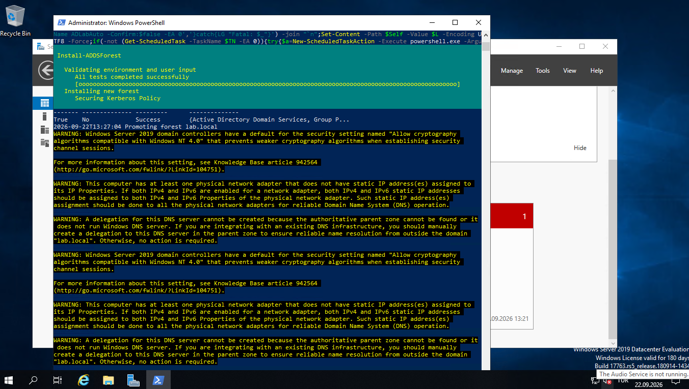

# 🛡️ Enterprise Active Directory & BadBlood Cyber Range Deployment

Welcome to the **Enterprise Active Directory & BadBlood Cyber Range** documentation. This repository provides complete architectural documentation, step-by-step installation guides, attack scenario execution playbooks, and mitigation procedures for a fully populated, vulnerable Active Directory testing environment.



---

## 🎯 Executive Summary & Scenario Overview

Modern enterprise networks rely heavily on **Active Directory Domain Services (AD DS)** for centralized identity and access management. However, misconfigurations, legacy settings, and complex delegation chains frequently create critical security vulnerabilities that attackers exploit to gain full domain compromise (Domain Admin / Enterprise Admin).

To simulate a realistic enterprise environment, this lab provisions a fresh Active Directory forest (**`lab.local`**) hosted on **Windows Server 2019 Datacenter**. Following base domain creation, the environment is injected with dynamic mock enterprise data using **BadBlood**. This populates the domain with thousands of randomized objects, nested organizational units (OUs), cross-linked security groups, and intentional Access Control List (ACL) misconfigurations.

### 🏢 Target Architecture

```
                                  [ LAB.LOCAL FOREST ROOT ]
                                             │
                             ┌───────────────┴───────────────┐
                             │                               │
                [ Primary Domain Controller ]      [ Security Lab Workstations ]
                   • Hostname: DC01                   • Windows 10/11 Enterprise
                   • OS: Windows Server 2019          • BloodHound / SharpHound
                   • IP: Static IPv4 / IPv6           • Kali Linux / Impacket
                   • Roles: AD DS, DNS, Kerberos
                             │
                             ▼
                [ BadBlood Population Engine ]
                   • 500+ User Accounts
                   • Nested Security Groups
                   • Complex OU Hierarchy
                   • Vulnerable ACLs / ACEs
```

---

## 🛠️ Detailed Step-by-Step Deployment Log

### Step 1: Active Directory Domain Services (AD DS) Provisioning

The forest deployment was executed via automated PowerShell scripts invoking the `Install-ADDSForest` cmdlet to create the root domain `lab.local`.

#### **Executed Command Sequence:**
```powershell
Import-Module ADDSDeployment
Install-ADDSForest `
    -CreateDnsDelegation:$false `
    -DatabasePath "C:\Windows\NTDS" `
    -DomainMode "WinThreshold" `
    -DomainName "lab.local" `
    -DomainNetbiosName "LAB" `
    -ForestMode "WinThreshold" `
    -InstallDns:$true `
    -LogPath "C:\Windows\NTDS" `
    -NoRebootOnCompletion:$false `
    -SysvolPath "C:\Windows\SYSVOL" `
    -Force:$true
```

#### **Execution Milestones & Diagnostics:**
1. **Environment Validation:** Verified prerequisites, path availability, and schema compatibility.
2. **Kerberos Security Policy Setup:** Initialized default Kerberos ticket policy (TGT lifetime, clock skew allowance).
3. **Forest Promotion:** Promoted the server instance to Domain Controller for `lab.local`.
4. **Directory Database Initialization:** Instantiated `NTDS.dit` database and SYSVOL share structures.

---

### Step 2: BadBlood Injection & AD Graph Escalation Paths

A completely clean Active Directory environment does not reflect real-world attack vectors. Real environments suffer from "permission bloat" and accidental delegation over time. **BadBlood** automates this complexity by injecting realistic non-linear relationships.

#### **BadBlood Operations Executed:**
1. **OU Hierarchy Generation:** Creates deep, nested Organizational Units resembling enterprise divisions (e.g., `HR`, `Engineering`, `IT Ops`, `Executive`).
2. **User & Computer Object Creation:** Generates hundreds of randomized user accounts and computer objects across OUs.
3. **Nested Security Group Expansion:** Configures complex group memberships (Group A inside Group B inside Group C) to hide transitive privileges.
4. **ACL/ACE Misconfigurations:** Grants dangerous Access Control Entries (ACEs) to non-admin users, including:
   - `GenericAll` / `GenericWrite` permissions over privileged objects.
   - `WriteDacl` permissions allowing attackers to modify object permissions.
   - `ForceChangePassword` rights over high-privilege users.
   - `UserAccountControl` flags set to `DONT_REQUIRE_PREAUTH` (AS-REP Roasting vector).

---

## 🚀 Cyber Security Test Cases & Red/Blue Team Playbooks

This lab environment is engineered to support both offensive attack path analysis and defensive detection engineering.

### 🔴 Red Team Operations (Attack Paths)

#### **1. AD Reconnaissance with BloodHound / SharpHound**
- **Objective:** Collect domain graph relationships and identify privilege escalation paths to `Domain Admins`.
- **Execution:**
  ```powershell
  Invoke-BloodHound -CollectionMethod All -Domain lab.local -ZipFileName ad_harvest.zip
  ```
- **Analysis:** Import collected JSON data into BloodHound GUI to execute Cypher queries like `Shortest Paths to Unconstrained Delegation` or `Shortest Paths to Domain Admins`.

#### **2. Kerberoasting Attacks**
- **Objective:** Request TGS tickets for accounts with Service Principal Names (SPNs) and crack the ticket hashes offline.
- **Execution:**
  ```bash
  GetUserSPNs.py lab.local/user:password -dc-ip <DC_IP> -request
  hashcat -m 13100 hashes.txt rockyou.txt
  ```

#### **3. AS-REP Roasting**
- **Objective:** Extract Kerberos AS-REP hashes for accounts configured without Kerberos pre-authentication.
- **Execution:**
  ```bash
  GetNPUsers.py lab.local/ -no-pass -usersfile users.txt -dc-ip <DC_IP>
  ```

#### **4. Abusing Weak ACLs / ACEs**
- **Objective:** Leverage `GenericWrite` or `WriteDacl` permissions identified by BadBlood to overwrite target passwords or grant explicit rights.
- **Execution:**
  ```powershell
  Set-ADAccountPassword -Identity "TargetUser" -NewPassword (ConvertTo-SecureString "P@ssword123!" -AsPlainText -Force)
  ```

---

### 🔵 Blue Team Operations (Detection & Hardening)

#### **1. Detection Engineering (Event Logs & SIEM)**
Monitor the Domain Controller event log for key security event IDs (EIDs):
- **EID 4624 / 4625:** Successful / Failed logon events.
- **EID 4768:** Kerberos Authentication Ticket (TGT) requested (AS-REP Roasting monitoring).
- **EID 4769:** Kerberos Service Ticket (TGS) requested (Kerberoasting monitoring).
- **EID 4738:** User Account object modified (detecting unauthorized permission changes).

#### **2. Active Directory Hardening Strategy**
1. **Remediate Over-Privileged ACLs:** Audit and remove unnecessary explicit ACEs granted to non-administrative users.
2. **Enable AES Encryption:** Disable legacy RC4 encryption for Kerberos to harden ticket request mechanisms.
3. **Implement Tiered Administration (Tier 0 / 1 / 2):** Enforce strict administrative boundaries to prevent credential harvesting across tiers.

---

## ⚠️ Installation Diagnostics & Warning Analysis

During the `Install-ADDSForest` execution, several warnings were recorded. Below is a technical breakdown of each diagnostic warning and its resolution in a production vs. lab context:

| Warning Diagnostic | Technical Description | Lab Impact & Mitigation |
| :--- | :--- | :--- |
| **Static IP Address Warning** | The system detected a network adapter using DHCP or an unassigned static binding. | **Lab Impact:** Low.<br>**Mitigation:** In production, Domain Controllers must have static IPv4/IPv6 addresses to prevent DNS failure across client nodes. |
| **DNS Delegation Warning** | An authoritative parent DNS zone could not be located to create a delegation for `lab.local`. | **Lab Impact:** None.<br>**Mitigation:** Expected behavior in isolated or root lab environments without a parent domain structure. |
| **Windows NT 4.0 Cryptography** | Default settings allow legacy NT 4.0-compatible cryptography algorithms. | **Lab Impact:** Low.<br>**Mitigation:** In production, disable legacy algorithms via Group Policy Object (GPO): `Network security: Allow cryptography algorithms compatible with Windows NT 4.0` -> `Disabled`. |

---

## 📦 Environment Specifications

- **Domain Name:** `lab.local`
- **NetBIOS Name:** `LAB`
- **Forest Functional Level:** Windows Server 2016 / 2019 (`WinThreshold`)
- **Domain Functional Level:** Windows Server 2016 / 2019 (`WinThreshold`)
- **Primary Roles Installed:** AD DS, DNS Server, Global Catalog (GC)
- **Data Generator:** BadBlood v2.0+

---

## 🏁 Conclusion

The `lab.local` environment is successfully promoted and augmented with complex graph structures via BadBlood. This setup provides an ideal playground for mastering Active Directory security, investigating Kerberos mechanics, testing offensive tooling, and authoring custom detection rules.
